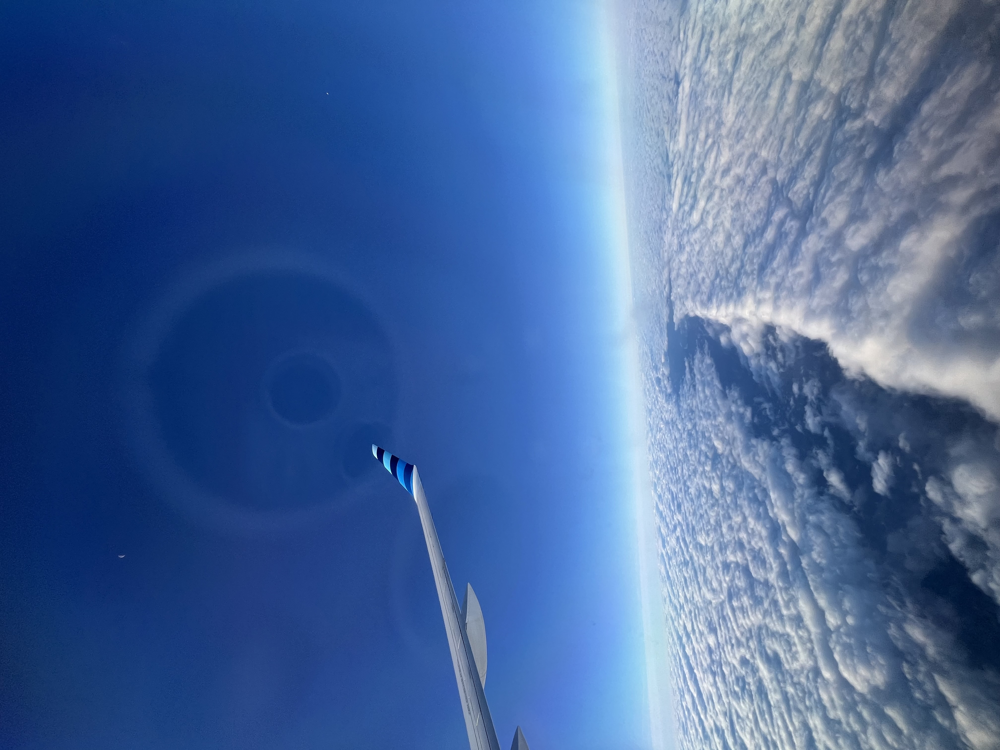
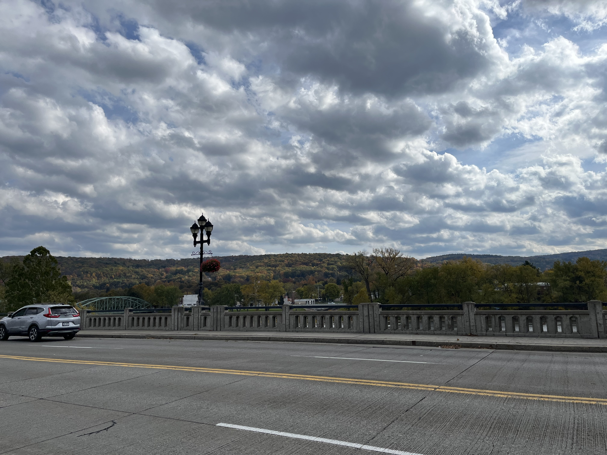
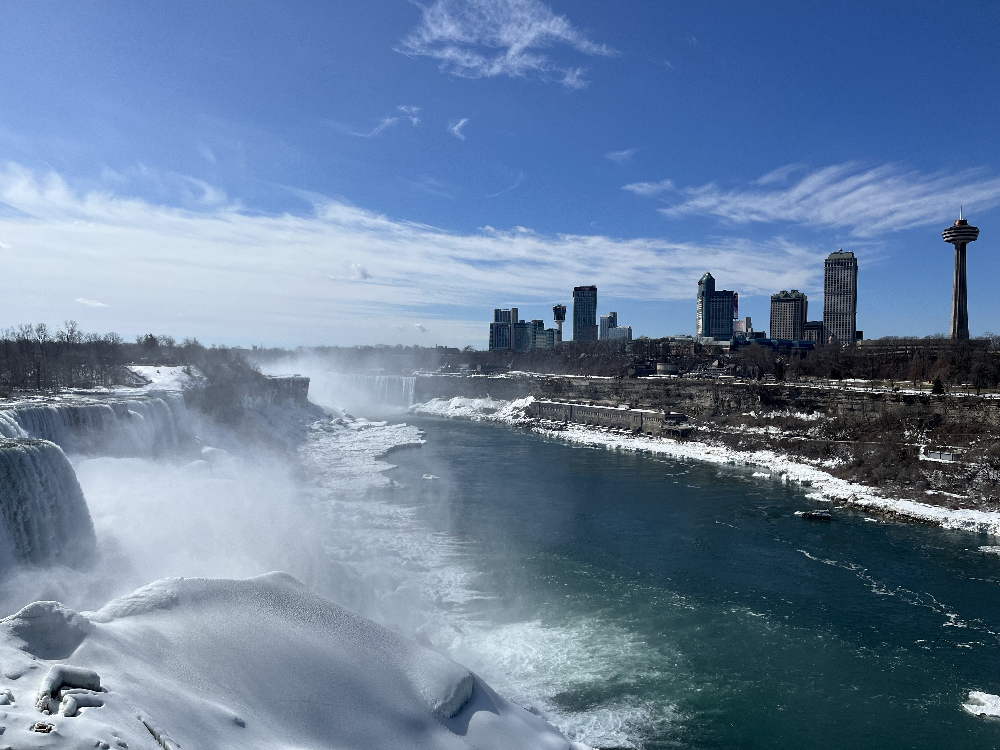
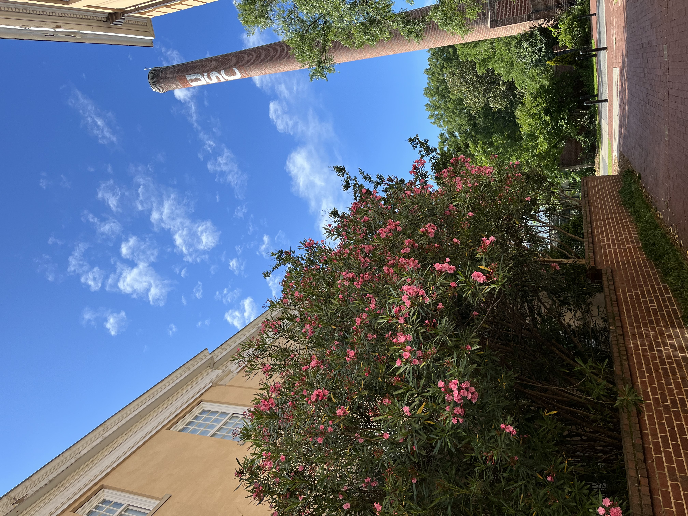
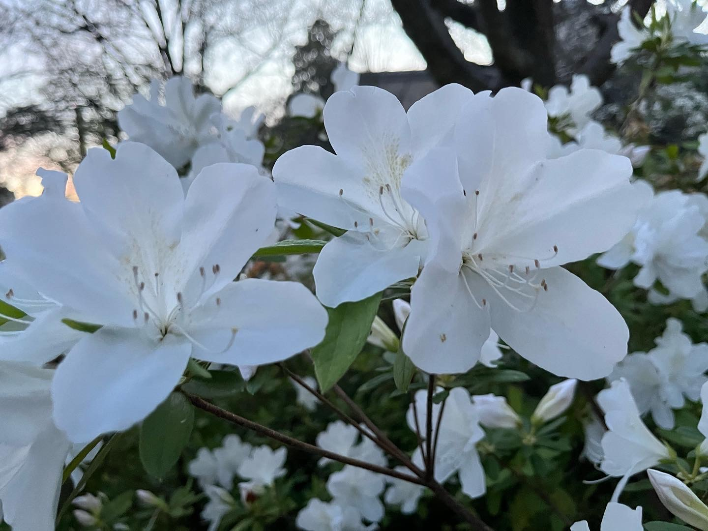
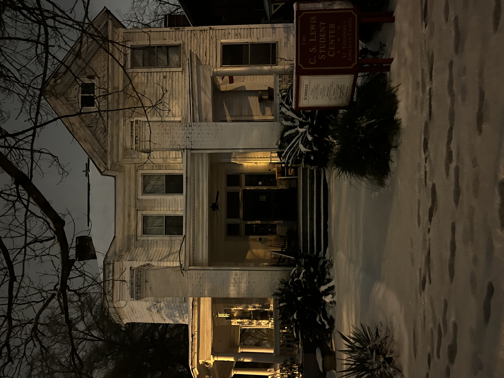
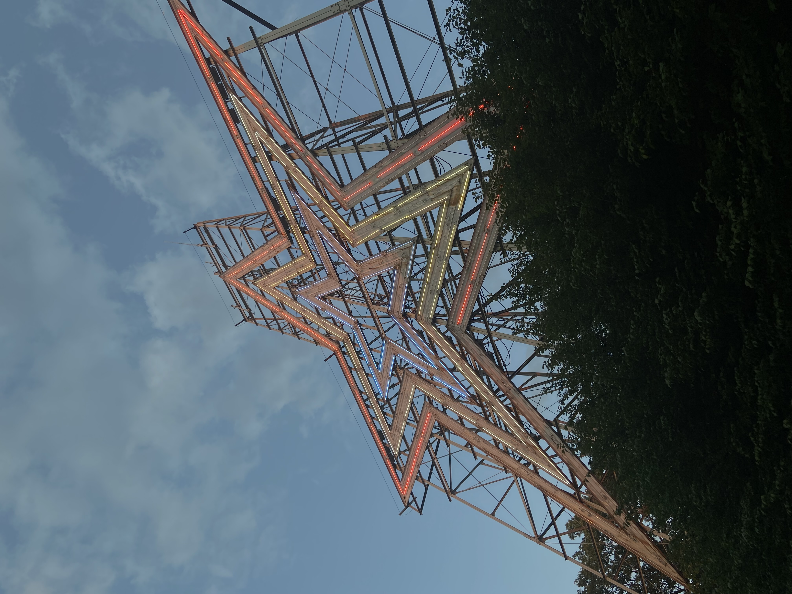
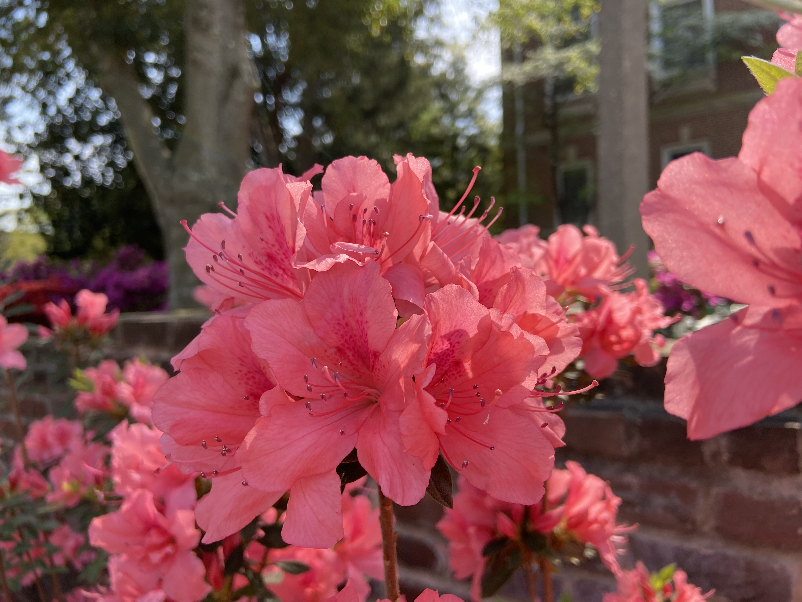

As alluded to on the landing page, I actually like photography in my spare time. While I don't do anywhere near professional-level work, and have never sought to, I find that simply having the ability to be behind a camera and capture a scene, of flowers, daily life, or a city view, is honestly really fun. So, to humanize me a little bit, and offer some beautiful things through the heaviness that is my work (there's a reason my personal Facebook says "terminal ruiner of the vibes with my work, jury's still out on that other stuff"), here are a few pictures I've taken. If you like what you see, while not professional, you might consider following [my photography Instagram page](https://www.instagram.com/axpphotography/)!

Note: All of these photos were taken with various iPhones, specifically an iPhone 13 (2022-present) and iPhone 11 (2019-2022).

{fig-alt="Airplane flying over cloud formation, November 2025"}

{fig-alt="Binghamton in the fall, October 2025"}

{fig-alt="Niagara Falls, Canada, March 2025"}

{fig-alt="USC Smokestack, May 2022"}

{fig-alt="White azaleas on Gibbes Green, March 2022"}

{fig-alt="C.S. Lewis Student Center in the snow, January 2022"}

{fig-alt="The Roanoke Star, 2021"}

{fig-alt="Pink azaleas, 2021, Currell College"}
