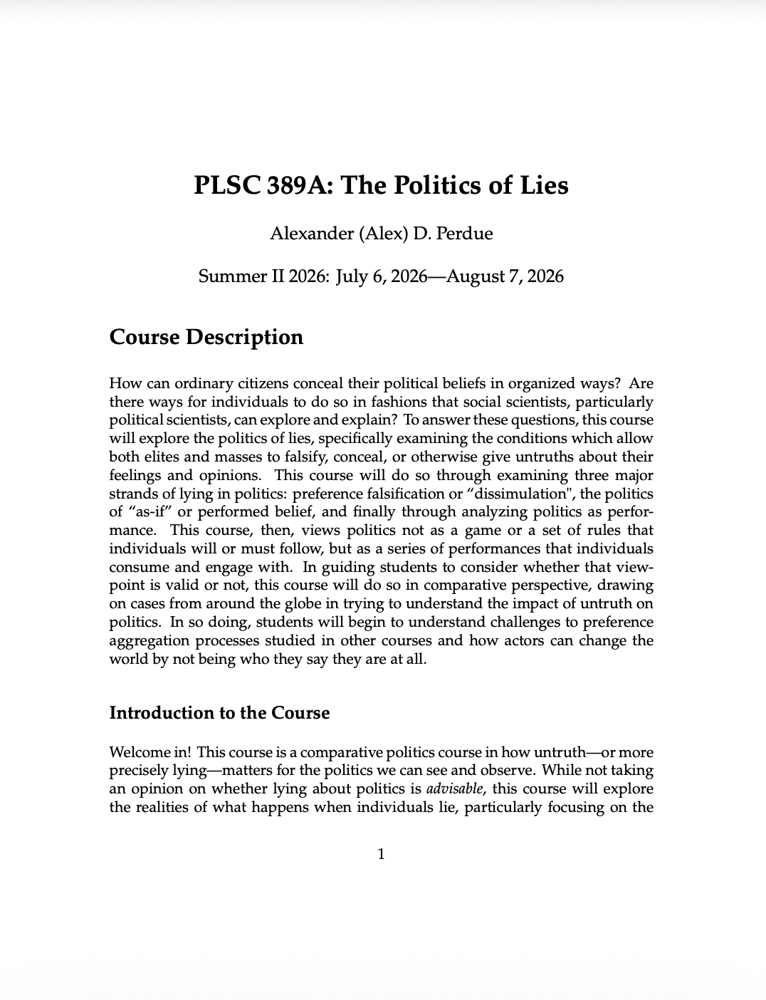

Below I discuss the courses I'm taught and the courses I'm scheduled to teach that have a syllabus prepped and ready to go. If any part of my courses, my language, my assignments, the specific setups of readings are of interest to you, please feel free to take them! I only ask that if you copy an assignment that you provide some measure of attribution. If you want to see a syllabus and the Dropbox links refuse to work, please just shoot me a message at the email on the Welcome page.

```{=html}
<h3>Summer 2026: The Politics of Lies</h3>
<table>
  <tr>
    <td style='width: 30%; padding-right: 20px;'>
      <a href='https://www.dropbox.com/scl/fi/a0l9le36qjmuuojsamkvd/Summer-2026-Politics-of-Lies.pdf?rlkey=coh7bw9g5xjsjh44ymdqukofi&st=6t1xvav2&dl=0'>
        
      </a>
    </td>
    <td style='vertical-align: top;'>
      This course will be taught in Summer 2026. It is an undergraduate introduction to performance politics or, more broadly, the concepts of dissimulation, performed belief, and big lies. In other words, I'm going to introduce my undergraduates to why lies are important in politics. This is, once again, truncated due to time constraints, but hits the major topics I'd cover at least lightly, though not with the depth (or the appreciation of some writers) that I'd do in a full semester course. This is (hopefully) setting me up to teach a full semester course on the topic in the future.</td>
  </tr>
</table>
```

```{=html}
<h3>Spring 2026: History, Memory, and Politics</h3>
<table>
  <tr>
    <td style='width: 30%; padding-right: 20px;'>
      <a href='https://www.dropbox.com/scl/fi/hna5aljihyneskgll2bev/Spring-2026-History-Memory-and-Politics.pdf?rlkey=e7nc3xn0xfn0qtccqlw4aaw2j&st=31uloiik&dl=0'>
        
      </a>
    </td>
    <td style='vertical-align: top;'>
      This course is being taught presently in Spring 2026. It is a semester-long extension of the Memory Politics course from the summer. After covering the ground of the Memory Politics course in the first half, it adds applications and concludes at the precipice of the course I plan to teach in Summer 2026 on the Politics of Lies. We've also focused globally in this course due to my own proclivities, but we've paid special attention to the issues in my home region of the Southern United States for visibility and importance reasons.</td>
  </tr>
</table>
```

```{=html}
<h3>Summer 2025: Memory Politics</h3>
<table>
  <tr>
    <td style='width: 30%; padding-right: 20px;'>
      <a href='https://www.dropbox.com/scl/fi/p1q660467rvo097wldvk8/Summer-2025-Memory-Politics.pdf?rlkey=63jjomewt8np3fkbkfn8xzcan&st=ulhevtft&dl=0'>
        
      </a>
    </td>
    <td style='vertical-align: top;'>
      This course was taught in Summer 2025. It was inspired by the writing of "Forged in Firing". I went through the process of collective memory formation in societies for undergraduate students. It explored these issues globally, though perhaps with a special interest in my home region of the Southern United States. It was intentionally 'barebones' or shortened due to the length, but if you want to know how I'd teach a semester long version of a memory politics class....</td>
  </tr>
</table>
```

```{=html}
<h3>Spring 2025: Crime, Justice, and Politics</h3>
<table>
  <tr>
    <td style="width: 30%; padding-right: 20px;">
      <a href="https://www.dropbox.com/scl/fi/txf496w3k4jvnul321ws9/Spring-2025-Crime-Justice-and-Politics.pdf?rlkey=wqcsxde1d1mxb3hrgr8s5q3fw&st=c05u3ydq&dl=0">
        
      </a>
    </td>
    <td style="vertical-align: top;">
      This course was taught in Spring 2025. It was a course exploring global criminal justice politics to advanced undergraduate students. We studied it through three "lenses": jails and policy, the prison system and the carceral state, and finally migration. While registered under my department's course system as an American politics course, and yes a lot of the material covered was in the United States, the goal was to get students to think beyond their legal studies courses and embrace a global perspective on these issues. If I taught this again, I would heavily edit it.
    </td>
  </tr>
</table>
```
