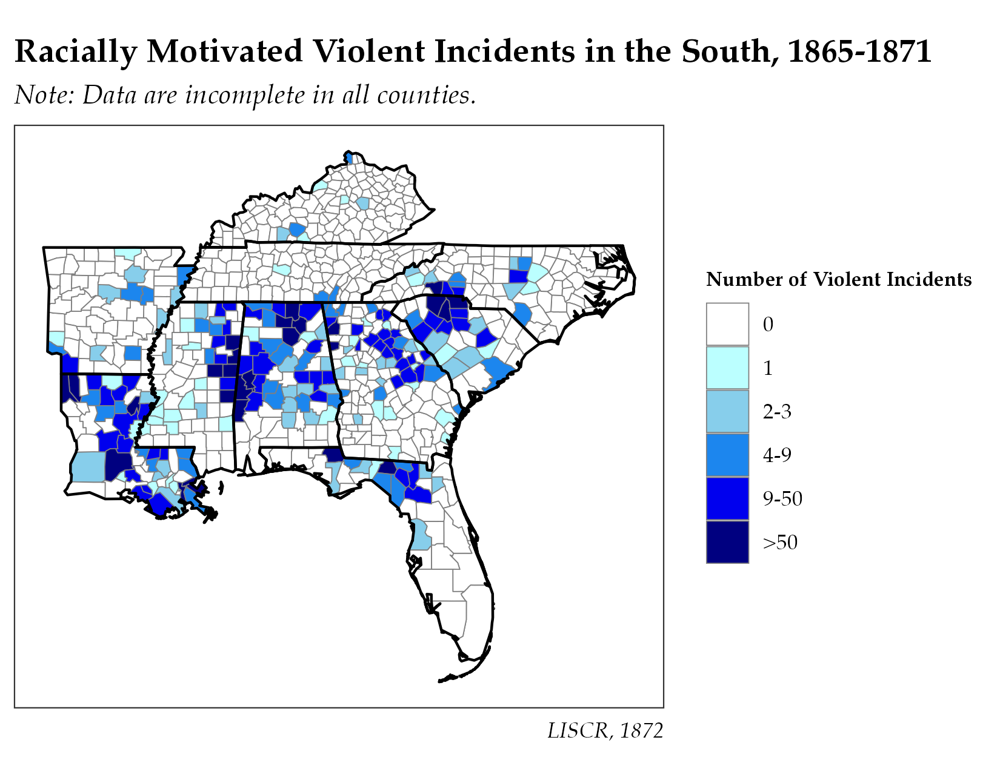

{fig-alt="Racial violence in the US South, 1865-1871"}

As mentioned on the landing page, my work encompasses several related areas related to the study of conflict. While the main area I've done work on so far has been the United States, I'm interested more broadly in any area where white supremacy or white nationalism has, or continues to rear, its ugly head. To that extent, you might find yourself interested in either of the working papers detailed below, or maybe even in some of the "where Alex is going next when he's not knee-deep in the dissertation" stuff.

To answer the question you might have: I study why white supremacy and white nationalism continue to exist, how they challenges the state and impel and promote (or not) political violence, and what states do about that not because I find the answers incredibly heartening. I examine them because I'm fascinated by them as someone who came-of-age in the shadow of Charlottesville and Black Lives Matter, and who understands the divisiveness and power of white violence, both historically and contemporarily, to shape politics around it.

<details>

<summary>Working Papers</summary>

1.  "Forged In Firing": The Creation of Identity in the Aftermath of Civil War

    ```{=html}
    <a href="https://www.dropbox.com/scl/fi/k5qlfuymzdkfczwhpyp51/FIF.pdf?rlkey=045mo48ncz4vcul6azttnqnbs&st=z1nohmmy&dl=0">Working Paper Draft</a> | <a href="https://www.dropbox.com/scl/fi/83ki9rh39tuwa3ut4sljr/FIF-Appendices.pdf?rlkey=w16bol22zeo0dq4kq6vpo081z&st=jla0x51t&dl=0">Draft Appendices</a>
    ```

Scholars of civil conflict have long sought to develop a unified theory of post-conflict political behavior surrounding identity and memory. In this article, I propose a process by which groups use their personal and collective memory of wartime experiences to craft boundaries between themselves and out-groups which did not experience that boundary. I contend that one way to observe this process is through a physical manifestation of this collective memory: monument construction. Using the American South in the aftermath of the American Civil War as the exemplar case, I test this. I find that while physical manifestations had different effects in the aftermath of the War, these effects attenuated in time.

2.  "...ghosts never come back again" : Reconstruction and Racial Violence in the United States

    ```{=html}
    <a href="https://www.dropbox.com/scl/fi/o64wwl1wc7y2hg6qrmsjq/GNCA.pdf?rlkey=w9yq0dmnizpaddto2q206b5f3&st=2h4hblej&dl=0">Working Paper Draft</a> | <a href="https://www.dropbox.com/scl/fi/bkdbbbfzsxw2wst61j082/GNCA-Appendices.pdf?rlkey=qpisu2cc9dcqmsgjyj5rbad07&st=0hu1wei5&dl=0">Draft Appendices</a> | Klan Violence Data Available <a href="mailto:aperdue2@binghamton.edu">Upon Request</a>
    ```

Recent contributions have sought to explain the successes and failures of Reconstruction-era counterinsurgency policy. However, they have failed to engage with one large contributor to the failure of them: violence by the first wave Ku Klux Klan. I introduce an original dataset on racial violence in the South from 1865 to 1871 which details, if only partially, the extent of Klan violence. In so doing, I find that the backlash effect of black troop deployments on violence posited by Byun and Kwon (2026) did not in fact exist during the Reconstruction era, suggesting that scholars have not yet developed an explanation of racial violence and Reconstruction's effects, a large gap in political science's understanding of nationbuilding policies and of American political development, nor of the consequences of Reconstruction-era counterinsurgency activity.

\[This is also the project from which the image at the top of this page originates!\]

</details>

<details>

<summary>Works In Progress</summary>

**Dissertation: *Standing Proud? On Responses to White Ethnonationalist Claimmaking***

While details are sparse at the moment (intentionally!), I am also in the process of collecting data and writing my dissertation. Engaging work across organizational political culture, contentious politics, political sociology, history, and plenty about white nationalism's history and present, I argue that the white nationalist movements can best be understood by the processes of community-building they engage in. Specifically, I argue, or rather will argue, that the creation of discursive community is a first step in the creation of physical community and that it is the creation of *physical* community that raises the ire of the state.

A full page will be made available when the dissertation's first full chapter drafts are completed.

</details>

<details>

<summary>Works In Development</summary>

***Disclaimer***

All of these works listed are very much **in development**. They will grow, they will change, so will I. I am happy to discuss these in more detail if you're interested (or are interested in collaborating on them!), but realize there's less I can appreciably say yet about them. For the most part, these are in the "next up" section of my mind and don't appear on my CV.

1.  "...a burnt child fears the fire": Exploring White Supremacist Victimization Experiences

In an intermediate stage of development but on hiatus due to the dissertation, this paper will look at the voices of the victims who testified in the 1872 Report of the Joint Select Committee Appointed to Inquire in to the Affairs of the Late Insurrectionary States. While still early, the data collection for this paper is fairly well complete. While my work acknowledges, and will continue to acknowledge, the lightly networked nature of the first Klan, this paper will inquire into commonalities both within and across space of victims' diverse experiences and try to contribute to the victimology of white supremacy. It will draw on, and expand on, contemporary models of blame attribution to explore those commonalities. **(Because its data collection accompanied that for Ghosts, this item appears on my curriculum vitae.)**

2.  "If you cannot vote with us, you shall not vote at all": Election Violence in Reconstruction-Era Louisiana

In an early stage of development and on hiatus due to the dissertation, this paper will examine unorganized election violence in the Reconstruction-era South through one of the bloodiest states for it, Louisiana. Drawing on testimony given to Congressional committees investigation elections in Louisiana at that time, and state committees if I can get my hands on their reports and testimony, it will at least present further data on the scale and scope of election violence in the Reconstruction-era South. Thus, it will at least contribute to open questions about the scale and scope of historical election violence globally and contribute to understandings in political science about how white supremacists have terrorized the ballot box.

3.  "A Remonstrance Against Such Outrages": Open Fictions and the Klan Conspiracy

In the earliest stage of development and also on hiatus due to the dissertation, this paper will drawing on later historiographic ideas of the first wave Ku Klux Klan as a conspiracy and ideas about coverups and lying in politics pioneered today, I intend to (eventually) explore the evolution of how the first wave Ku Klux Klan was discussed by contemporary Southern newspapers. Very up front: I know that there's a lot of variation in the specific ways Southern newspapers discussed the Klan and treated it. Some of that is a function of local conditions, but documentary evidence also points to consistent means, either dismissing it, tacitly supporting it, or lying about it. Why did Southern newspapers, and by extension their communities, lie about something that was claimed to be broadly supported? As a bigger picture question: why do consensus fictional views about politics change over time? And why do political fictions get used in the first place?

</details>
