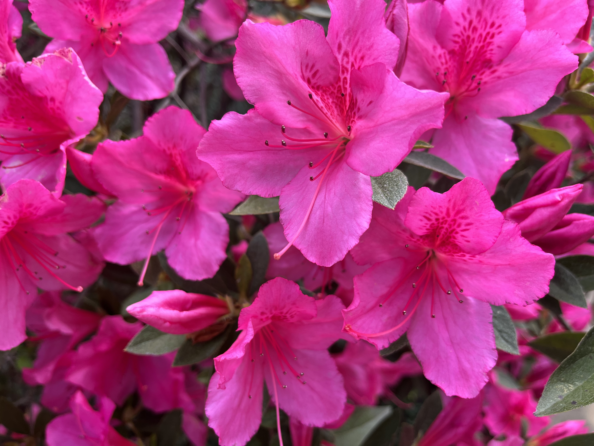

{fig-alt="Pink azaleas, from the University of South Carolina campus, c. 2022."}

Welcome! I am a PhD Candidate (ABD) in Political Science at Binghamton University. I study organizational political culture and political violence, especially of white supremacist and white ethnonationalist groups. In my research, I bridge debates about the politics of self-determination using tools from the literature on social movement organization, the organization of contentious collectives, and political violence. I also study historical political violence by racially violent actors, most notably the first wave Ku Klux Klan in the United States.

For more information about my [research](research.qmd) and my [teaching](Teaching.qmd) to date, please feel free to explore the other pages on this website or my [Curriculum Vitae](https://www.dropbox.com/scl/fi/ol9t73agrfx8nnn9hlps5/CV.pdf?rlkey=76cn494w21yrmlpa9kyaiayr3&st=cjdwg2dk&dl=0). If you're looking for a quick pick-me-up after that, consider exploring my [photography](photography.qmd)!

To contact me about my work, commisserate about the absolute state of South Carolina Gamecocks athletics, or chat about jazz or life with autism spectrum disorder in academia, please feel free to drop me a line at any of the places below!

```{=html}
<a href="mailto:aperdue2@binghamton.edu"><i class="fa-solid fa-envelope fa-2x"></i></a> <a href="https://www.linkedin.com/in/adperdue/"<i class="fa-brands fa-linkedin fa-2x"></i></a> <a href="https://x.com/alexperduetoo/"<i class="fa-brands fa-twitter fa-2x"></i></a>
```
